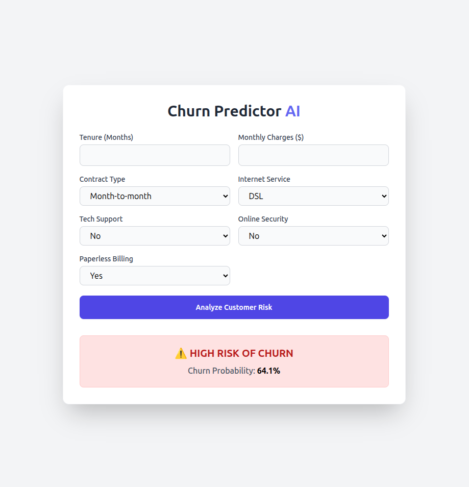
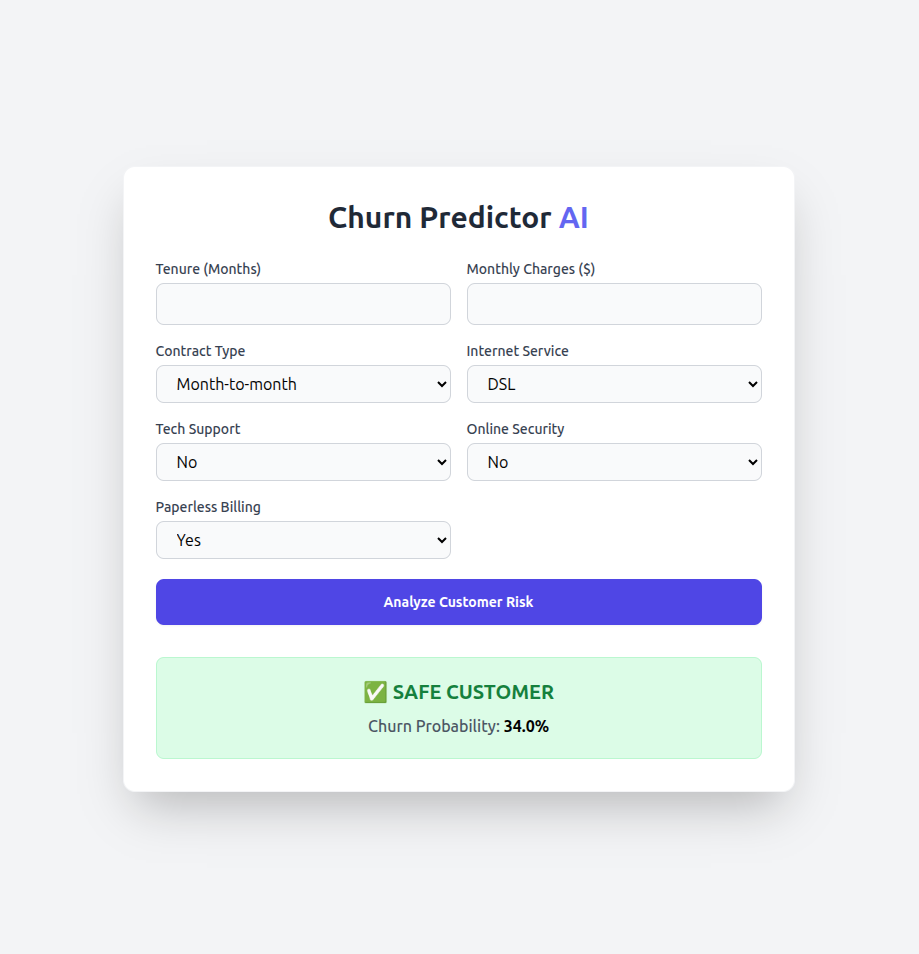

# 📉 Telco Customer Churn Predictor AI

*(Note: As this is hosted on a free tier, the server may take 30-50 seconds to wake up on the first load. Thank you for your patience!)*

## 📌 Project Overview
This project is an end-to-end Machine Learning pipeline that predicts whether a telecom customer will cancel their service (churn). It includes data cleaning, feature engineering, handling imbalanced data (SMOTE), model training (Logistic Regression), and a fully deployed FastAPI web interface.

## 🚀 The Web Application
The model is wrapped in a blazing-fast **FastAPI** backend with a modern **Tailwind CSS** frontend. Users can input customer details and instantly receive a Churn Probability percentage.

### Interface Screenshots

**High Risk Customer Detection:**

**Safe Customer Detection:**

---

## 🧪 Test it Yourself!
Want to test the live model? Try inputting these two vastly different customer profiles into the web app:

**Profile 1: Likely to Churn (High Risk)**
* **Tenure:** 2 months | **Contract:** Month-to-month | **Internet:** Fiber Optic
* **Tech Support:** No | **Online Security:** No | **Monthly Charges:** $95.50

**Profile 2: Likely to Stay (Safe)**
* **Tenure:** 68 months | **Contract:** Two year | **Internet:** DSL
* **Tech Support:** Yes | **Online Security:** Yes | **Monthly Charges:** $25.00

---

## 📊 Business Insights
Based on the model's feature importance analysis, we discovered exactly what drives customer behavior:
* **Top Drivers of Churn:** Month-to-month contracts, Fiber Optic internet, and lack of Tech Support.
* **Top Drivers of Retention:** Two-year contracts, longer tenure, and having supplementary security services.

## 🛠️ Tech Stack
* **Machine Learning:** Scikit-Learn, Pandas, Imbalanced-Learn (SMOTE)
* **Backend:** FastAPI, Uvicorn, Python
* **Frontend:** HTML, Tailwind CSS, Jinja2
* **Deployment:** Render

## 💻 How to Run Locally
1. Clone this repository: `git clone https://github.com/YourUsername/YourRepo.git`
2. Install the requirements: `pip install -r requirements.txt`
3. Run the server: `uvicorn app:app --reload`
4. Open your browser and go to `http://127.0.0.1:8000`