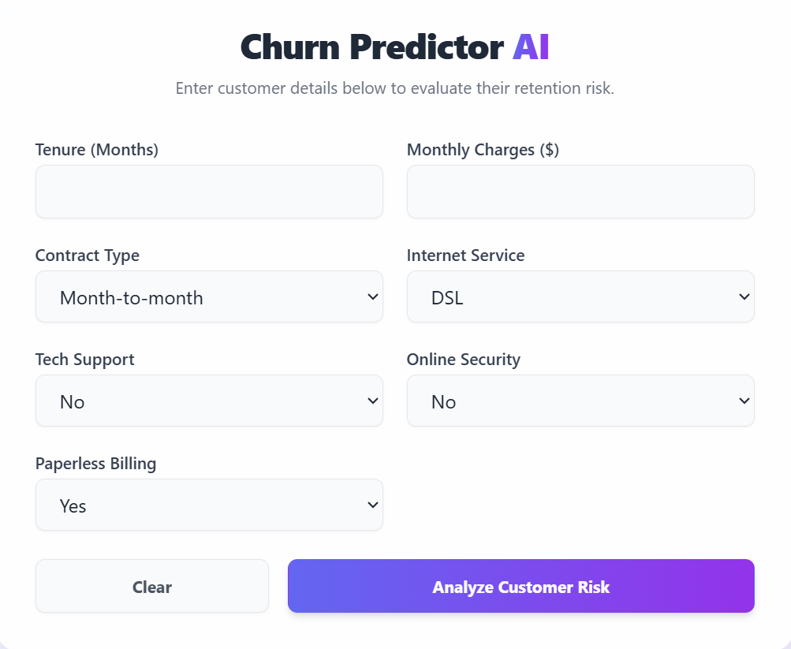
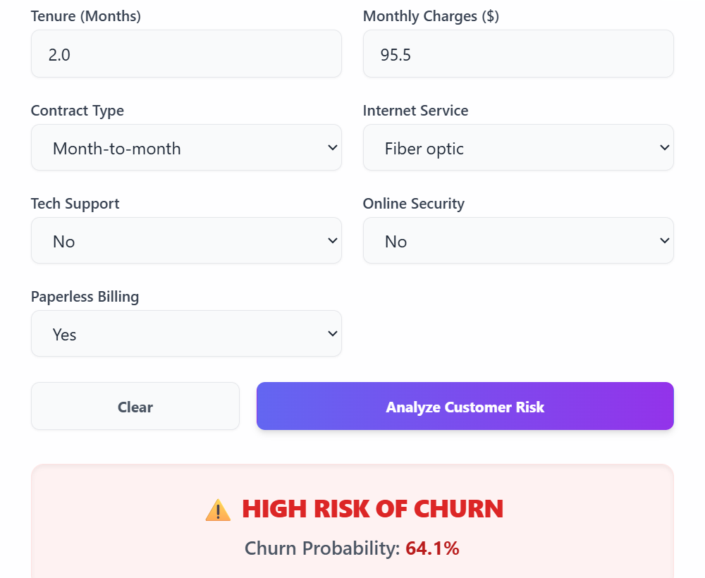
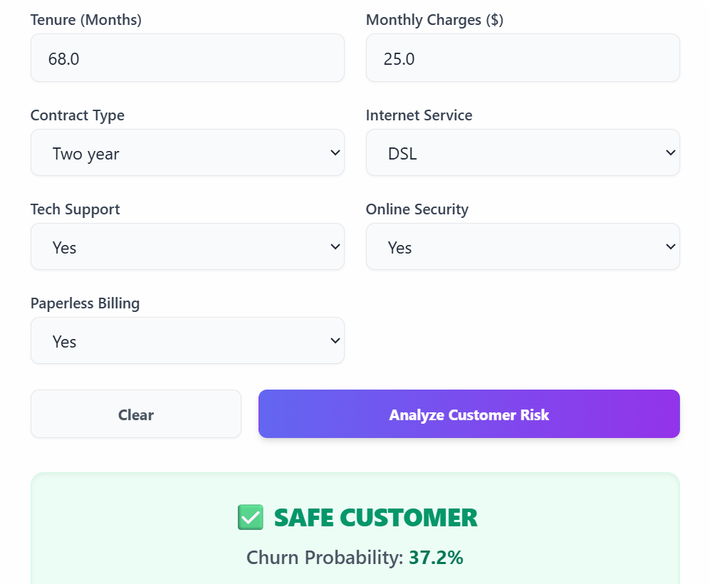

# 📉 Telco Customer Churn Predictor AI

[](https://www.python.org/)
[](https://fastapi.tiangolo.com/)
[](https://www.docker.com/)
[](https://www.postgresql.org/)
[](https://github.com/features/actions)

[](https://churn-prediction-project-i7g4.onrender.com/)

## 📌 Project Overview
This project is a fully deployed Machine Learning application that helps telecom companies identify customers who are at high risk of canceling their subscriptions. Users can input customer metrics into the modern web dashboard and instantly receive a churn probability score.

<p align="center">
  
</p>

---

## 📸 Prediction Results

| High Risk Customer Detection | Safe Customer Detection |
| :---: | :---: |
|  |  |

---

## 🏗️ System Architecture & MLOps
This project is built to mirror enterprise-level software standards, moving beyond a simple ML script into a fully containerized, tested, and deployed web service.

* **Machine Learning:** Imbalanced data handled via SMOTE, trained using Logistic Regression (Scikit-Learn), and serialized for production.
* **Backend API:** Built with FastAPI for high-performance, asynchronous request handling.
* **Database:** Production predictions are securely logged to a cloud-hosted PostgreSQL database for future model retraining and monitoring.
* **Containerization:** Fully containerized using Docker (Python 3.12-slim base) for consistent environments across development and production.
* **CI/CD Quality Gate:** Automated GitHub Actions pipeline that lints code (Flake8) and runs automated tests (Pytest) in an isolated in-memory SQLite database before allowing deployments.

### Workflow Diagram
```mermaid
graph TD
    A[User Browser / UI] -->|Input Data| B(FastAPI Application)
    B --> C{Scikit-Learn Model}
    C -->|Churn Prediction| B
    B -->|Log Request & Result| D[(PostgreSQL Database)]
    E[GitHub Actions] -->|Pytest & Flake8| B
    E -->|Deploy| F[Render Docker Container]

---

## 📊 Business Insights & ML Performance
Based on the model's feature importance analysis, we discovered exactly what drives customer behavior:
* **Top Drivers of Churn:** Month-to-month contracts, Fiber Optic internet, and lack of Tech Support.
* **Top Drivers of Retention:** Two-year contracts, longer tenure, and having supplementary security services.
* **Model Performance:** Achieved an 79% accuracy rate and a 0.71 F1-score on the testing holdout set.

---

## 🧪 Test it Yourself!
Want to test the live model? Try inputting these two customer profiles straight into the web app:

**Profile 1: Likely to Churn (High Risk Customer)**
* **Tenure:** 2 months | **Contract:** Month-to-month | **Internet:** Fiber Optic
* **Tech Support:** No | **Online Security:** No | **Monthly Charges:** $70.70

**Profile 2: Likely to Stay (Safe Customer)**
* **Tenure:** 72 months | **Contract:** Two year | **Internet:** DSL
* **Tech Support:** Yes | **Online Security:** Yes | **Monthly Charges:** $90.25

---

## 📂 Repository Structure
```text
├── .github/workflows/      # CI/CD pipeline configuration (GitHub Actions)
├── notebooks/              # Jupyter notebooks for data exploration and model training
├── screenshots/            # Images used in the README documentation
├── static/                 # Static assets (CSS, JS, images for the web app)
├── templates/              # Jinja2 HTML templates for the frontend web UI
├── .env                    # Environment variables (Ignored in Git)
├── .flake8                 # Configuration for code linting rules
├── .gitignore              # Specifies intentionally untracked files to ignore
├── app.py                  # Main FastAPI application and API routing
├── churn.csv               # Raw telco dataset used for model training
├── database.py             # Database connection and SQLAlchemy ORM setup
├── Dockerfile              # Docker container configuration for deployment
├── model.pkl               # Trained Logistic Regression model (Serialized)
├── README.md               # Project documentation
├── requirements.txt        # Python dependencies and libraries
├── test_app.py             # Pytest automated testing suite
└── test.db                 # Local SQLite database for testing

---

## 🚀 How to Run Locally

### Prerequisites
Before you begin, ensure you have the following installed:
* **Git:** To clone the repository.
* **Docker:** For running the application in an isolated, 100% reproducible environment.

**1. Clone the repository:**
```bash
git clone https://github.com/MalindaBotheju/Churn-Prediction-Project.git
```
```bash
cd Churn-Prediction-Project
```

**2. Set up your Environment Variables:**

Create a .env file in the root directory and add your database URL (or use a local SQLite database for testing):
```bash
DATABASE_URL=sqlite:///./test.db
```
**3. Build and Run with Docker:**
```bash
docker build -t churn-api .
```
```bash
docker run -p 8000:8000 --env-file .env churn-api
```

**4. View the Application**

Frontend Web UI: Open http://localhost:8000

API Documentation: Open http://localhost:8000/docs

Developed by Malinda Boteju